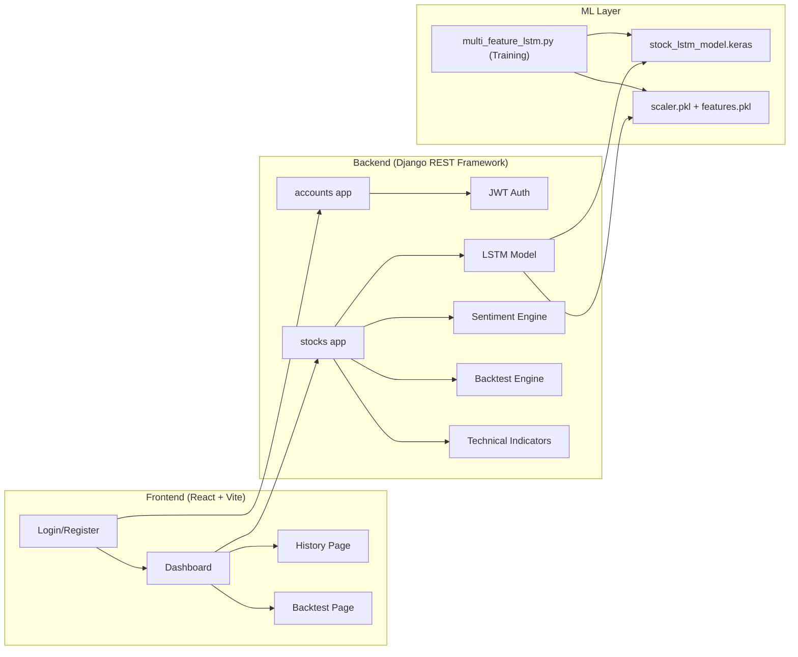

# Stock Prediction Portal — Project Analysis

## Overview

A **full-stack stock price prediction web application** using an LSTM (Long Short-Term Memory) neural network. The project is well-developed with both backend intelligence and a polished frontend dashboard.

---

## Architecture

---

## Tech Stack

| Layer | Technology |
|-------|-----------|
| **Frontend** | React 19 + Vite 8 |
| **Charts** | Recharts |
| **HTTP Client** | Axios |
| **Routing** | React Router DOM v7 |
| **Backend** | Django + Django REST Framework |
| **Auth** | JWT (SimpleJWT) |
| **ML Model** | Keras LSTM (3-layer, 128→64→32 units) |
| **Data Source** | yfinance (Yahoo Finance API) |
| **News API** | Finnhub (free tier) |
| **Database** | SQLite |

---

## Features Built ✅

### 1. 🔐 Authentication System
- **Custom User Model** (`CustomUser`) — email-based login instead of username
- **JWT Token Auth** — login, register, token refresh, and `/me` endpoint
- Protected routes via `PrivateRoute` component on the frontend

### 2. 🤖 LSTM Stock Price Prediction
- **Multi-feature model** trained on 5 major stocks (AAPL, MSFT, GOOGL, TSLA, NVDA)
- **8 input features**: Close, Open, High, Low, Volume, RSI, MACD, 20-day MA
- **3-layer LSTM**: 128 → 64 → 32 units with Dropout (0.2)
- **7-day forecast** with sliding window prediction
- **Monte Carlo Dropout** (20 runs) for confidence intervals (5th–95th percentile bands)
- Fallback to deterministic prediction if MC fails

### 3. 📊 Technical Indicators
Computed live from Yahoo Finance data:
- **RSI (14-period)** — with OVERBOUGHT / OVERSOLD / NEUTRAL signals
- **MACD (12, 26, 9)** — with BULLISH / BEARISH signals
- **Bollinger Bands (20-day)** — with OVERBOUGHT / OVERSOLD / NEUTRAL signals

### 4. 📰 News Sentiment Analysis
- Fetches headlines from **Finnhub API** (last 7 days)
- **VADER-inspired** bag-of-words scorer with:
  - Positive/negative word lists (~50 words each)
  - Negation handling (e.g., "not bullish" → bearish)
  - Intensifier handling (e.g., "extremely strong" → amplified score)
- Returns: overall label (BULLISH/BEARISH/NEUTRAL), score (-1 to +1), and individual headline scores

### 5. 🎯 Combined Signal Engine
Aggregates signals from:
- LSTM prediction (BUY if >+2% return, SELL if <-2%)
- RSI signal
- MACD signal
- News sentiment
- Produces: **STRONG BUY**, **BUY**, **HOLD**, **SELL**, or **STRONG SELL**

### 6. 📈 Backtesting Engine
- Simulates trading over historical periods (6mo, 1y, 2y)
- Uses Monte Carlo predictions (5 runs for speed) at each trading day
- Transaction cost simulation (0.1%)
- **Metrics reported**: Total return, Buy & Hold return, Alpha, Win rate, Max drawdown, Sharpe ratio
- Trade log with individual P&L

### 7. ⭐ Watchlist
- Add/remove ticker symbols to a personal watchlist
- Click a watchlist ticker → auto-runs prediction
- Stored per-user in database

### 8. 📜 Prediction History
- Every prediction is saved to the database with:
  - Current price, predicted prices (7-day), historical prices (60-day)
  - Expected return, predicted high/low, signal
- **Accuracy tracking fields** (designed for future scheduled job):
  - `actual_price_after_7d`, `actual_return_after_7d`, `prediction_error`
  - `was_correct` property that checks if signal direction matched reality
- **Stats endpoint**: total predictions, accuracy %, top tickers, signal breakdown

### 9. 🖥️ Frontend Dashboard
- **Dark-themed UI** with a professional trading terminal aesthetic
- **Main Price Chart**: Historical + 7-day forecast with confidence band (Recharts `ComposedChart`)
- **RSI Chart**: With overbought (70) and oversold (30) reference lines
- **MACD Chart**: MACD line, signal line, and histogram bars
- **Sentiment Panel**: Score bar, article breakdown, clickable headlines
- **Metric Cards**: Ticker, current price, forecast, expected return, signal
- **Indicator Pills**: RSI, MACD, Bollinger, combined signal badges
- **7-Day Forecast Table**: Day-by-day prices with confidence ranges and % change

---

## API Endpoints

| Method | URL | Description |
|--------|-----|-------------|
| POST | `/api/users/register/` | Register new user |
| POST | `/api/users/login/` | Get JWT tokens |
| POST | `/api/users/token/refresh/` | Refresh JWT |
| GET | `/api/users/me/` | Current user profile |
| GET | `/api/stocks/predict/?ticker=AAPL` | Run LSTM prediction |
| GET | `/api/stocks/history/` | Prediction history |
| GET | `/api/stocks/history/stats/` | Prediction stats |
| GET/POST | `/api/stocks/watchlist/` | List/add watchlist |
| DELETE | `/api/stocks/watchlist/<id>/` | Remove from watchlist |
| POST | `/api/stocks/watchlist/toggle/` | Toggle watchlist |
| GET | `/api/stocks/backtest/?ticker=AAPL&period=1y&capital=100000` | Run backtest |

---

## Frontend Pages

| Page | Route | Description |
|------|-------|-------------|
| Login | `/login` | Email + password login |
| Register | `/register` | User registration |
| Dashboard | `/dashboard` | Main prediction interface with charts |
| History | `/history` | Past prediction results |
| Backtest | `/backtest` | Strategy backtesting interface |

---

## Project Status Summary

> [!TIP]
> This is a **well-architected, feature-rich project** with a solid ML pipeline (training → serving), real-time data integration, and a polished dark-themed frontend. The core prediction loop, technical analysis, sentiment analysis, backtesting, and user management are all functional.

### What's working well:
- ✅ Full auth flow (register → login → protected routes)
- ✅ Multi-feature LSTM model trained and deployed
- ✅ Monte Carlo uncertainty estimation
- ✅ 3 technical indicators with live signals
- ✅ News sentiment from Finnhub
- ✅ Combined signal aggregation
- ✅ Backtesting with comprehensive metrics
- ✅ Watchlist with click-to-predict
- ✅ Prediction history with stats
- ✅ Rich interactive charts (Recharts)

### Potential areas for future work:
- ⬜ Scheduled job to fill `actual_price_after_7d` for accuracy tracking
- ⬜ Model retraining pipeline / automation
- ⬜ More stocks in training data
- ⬜ WebSocket for live price updates
- ⬜ Mobile responsive design improvements
- ⬜ Production deployment (PostgreSQL, Nginx, etc.)
